<!--
Resume-aligned profile README for Chaitanya Jhindal.
Public contact keeps email and social links visible.
Phone number from the resume is intentionally not published here by default.
-->

  

  

  
  
  

  
  
  
  

  <strong>Chaitanya Jhindal</strong> | <code>@ChaitanyaJhindal</code> | Generative AI Engineer

  Building LLM-powered applications, multimodal RAG systems, AI agents, and production-ready AI workflows with Python, FastAPI, vector databases, and modern full-stack tooling.

  

## About Me

<table>
  <tr>
    <td width="58%" valign="top">
      <strong>Professional Summary</strong>  
      Results-driven <strong>Generative AI Engineer</strong> focused on LLM-powered applications, multimodal RAG systems, AI agents, and scalable AI-driven platforms.  
      My work sits at the intersection of <strong>applied AI</strong>, <strong>automation</strong>, and <strong>cloud-ready engineering</strong>, with hands-on experience in FastAPI backends, retrieval systems, structured AI workflows, and modern full-stack delivery.  
      I am currently pursuing <strong>B.Tech in Computer Science & Engineering</strong> at <strong>BML Munjal University</strong>, while building real systems for healthcare, university knowledge retrieval, forecasting, and customer support use cases.
    </td>
    <td width="42%" valign="top">
      <pre lang="yaml">profile:
  title: Generative AI Engineer
  location: Gurugram, India
  education: B.Tech CSE, BML Munjal University
  graduation: 2027
  strengths:
    - LLM applications
    - multimodal RAG
    - AI agents
    - fine-tuning
    - FastAPI systems
  languages:
    - English
    - Hindi</pre>
    </td>
  </tr>
</table>

  
  
  
  

  

## Experience

<table>
  <tr>
    <td width="50%" valign="top">
      <strong>AI & Research Trainee</strong> 
      <code>Institute of Innovation & Entrepreneurship (I2E), BMU</code> 
      Sep 2025 - Apr 2026 | On-site | Gurugram  
      - Conducted deep-tech market research and startup ecosystem analysis using AI-driven workflows. 
      - Built structured investor and startup databases by scraping and analyzing <strong>5,000+ investor records</strong>. 
      - Identified <strong>30 high-potential investors</strong> from 5,000+ profiles, cutting manual filtering by <strong>99%</strong> and saving <strong>60+ hours</strong>. 
      - Automated outreach and competitive benchmarking for emerging AI and deep-tech ventures.  
      <strong>Stack:</strong> Python, Pandas, BeautifulSoup, Selenium, Excel, SQL, Data Analytics
    </td>
    <td width="50%" valign="top">
      <strong>Machine Learning Engineer Intern</strong> 
      <code>TechBrawn IT Solutions</code> 
      May 2025 - Jul 2025 | On-site | Gurugram  
      - Developed <strong>XGBoost-based sales forecasting</strong> models on <strong>100K+ SAP ERP records</strong>. 
      - Performed preprocessing, feature engineering, and exploratory analysis on large enterprise datasets. 
      - Built analytics workflows and automated reporting pipelines to reduce manual analysis effort. 
      - Contributed to AI-driven forecasting and business intelligence solutions for structured ERP data.  
      <strong>Stack:</strong> Python, XGBoost, Pandas, NumPy, Scikit-learn, SQL, Streamlit, SAP ERP
    </td>
  </tr>
</table>

  

## Tech Stack

<table>
  <tr>
    <td width="18%"><strong>Programming</strong></td>
    <td></td>
  </tr>
  <tr>
    <td><strong>Frameworks</strong></td>
    <td></td>
  </tr>
  <tr>
    <td><strong>Databases</strong></td>
    <td></td>
  </tr>
  <tr>
    <td><strong>Tools</strong></td>
    <td></td>
  </tr>
</table>

  
  
  
  
  
  
  
  

  

## Impact Snapshot

  
  
  
  

  
  
  
  

  

## Featured Projects

<table>
  <tr>
    <td width="50%" valign="top">
      <strong>CampusGPT</strong> 
      <code>Hybrid RAG Chatbot for University Knowledge Retrieval</code>  
      Developed a Hybrid RAG chatbot for intelligent querying across <strong>1200+ BMU webpages</strong> using semantic and keyword-based retrieval.  
      <strong>Architecture</strong> 
      <code>web crawl -> cleaning -> MiniLM summaries -> hybrid retrieval -> ChromaDB -> grounded answers</code>  
      <strong>Highlights</strong> 
      - MiniLM-based extractive summarization with cosine ranking and redundancy removal. 
      - <strong>10-14x reduction</strong> in vector storage. 
      - <strong>81% Top-1 Retrieval Accuracy</strong> and <strong>0.87 AUC</strong>.  
      
      
      
      
        
      
    </td>
    <td width="50%" valign="top">
      <strong>SehatSaathi</strong> 
      <code>AI-Powered Clinical Documentation and Healthcare Assistant</code>  
      Built an AI healthcare assistant that converts doctor-patient consultation audio into structured clinical reports using speech-to-text and LLM-based medical reasoning.  
      <strong>Architecture</strong> 
      <code>consultation audio -> STT -> speaker diarization -> LLM reasoning -> structured report -> PDF + app delivery</code>  
      <strong>Highlights</strong> 
      - Multilingual pipeline supporting <strong>23+ languages</strong>. 
      - Speaker diarization for up to <strong>8 speakers</strong>. 
      - Structured clinical reports and PDFs generated in <strong>under 10 seconds</strong>.  
      
      
      
        
      
      
    </td>
  </tr>
  <tr>
    <td width="50%" valign="top">
      <strong>Intelligent Customer Support Chatbot for E-Commerce</strong> 
      <code>Hybrid RAG + Fine-Tuned LLM Support System</code>  
      Built a production-ready AI support chatbot using <strong>Hybrid RAG</strong>, <strong>fine-tuned Gemma 2B</strong>, and <strong>GPT OSS 120B</strong> for e-commerce query resolution.  
      <strong>Architecture</strong> 
      <code>user query -> hybrid retrieval -> ChromaDB + MongoDB context -> MCP orchestration -> structured AI response</code>  
      <strong>Highlights</strong> 
      - MCP-based orchestration with <strong>100% schema compliance</strong>. 
      - Lightweight guardrails for harmful and off-topic queries with <strong>sub-millisecond latency</strong>. 
      - Evaluated across 10 support scenarios with <strong>27.33% ROUGE-1 F1</strong> and <strong>74.17% keyword recall</strong>.  
      
      
      
        
      
    </td>
    <td width="50%" valign="top">
      <strong>Applied ML Forecasting</strong> 
      <code>XGBoost Sales Forecasting on SAP ERP Data</code>  
      Built forecasting models on <strong>100K+ SAP ERP records</strong> to support demand prediction, business decision-making, and enterprise analytics workflows.  
      <strong>Architecture</strong> 
      <code>ERP data -> preprocessing -> feature engineering -> XGBoost -> analytics pipeline -> reporting</code>  
      <strong>Highlights</strong> 
      - Large-scale preprocessing and feature engineering on structured business data. 
      - Automated reporting to reduce manual analysis and surface faster insights. 
      - Delivered an AI-driven forecasting workflow tied to practical business intelligence use cases.  
      
      
      
        
      
      
    </td>
  </tr>
</table>

  

## AI Engineer Dashboard

  
  

  
  

  
  

  

  

## Education

<table>
  <tr>
    <td width="50%" valign="top">
      <strong>B.Tech in Computer Science & Engineering</strong> 
      <code>BML Munjal University</code> 
      2023 - 2027 | CGPA: 7.8 / 10  
      <strong>Relevant Coursework</strong> 
      Data Structures and Algorithms, Machine Learning, Artificial Intelligence, Database Management Systems, Operating Systems, System Design
    </td>
    <td width="50%" valign="top">
      <strong>Academic Snapshot</strong>  
      - Class 12th (CBSE), Science Stream: <strong>82%</strong> 
      - Class 10th (CBSE): <strong>91%</strong> 
      - Languages: <strong>English, Hindi</strong> 
      - Soft Skills: <strong>Leadership, Teamwork, Critical Thinking, Problem Solving</strong>
    </td>
  </tr>
</table>

  

## Current Build Direction

<table>
  <tr>
    <td width="50%" valign="top">
      <pre lang="txt">&gt; building_now
- LLM-powered applications
- multimodal RAG systems
- grounded AI agents
- production-ready FastAPI workflows</pre>
    </td>
    <td width="50%" valign="top">
      <pre lang="txt">&gt; going_deeper_on
- fine-tuning with QLoRA
- retrieval quality and evaluation
- structured AI response systems
- cloud-ready AI product engineering</pre>
    </td>
  </tr>
</table>

  

## Contribution Snake

  <picture>
    <source media="(prefers-color-scheme: dark)" srcset="https://raw.githubusercontent.com/ChaitanyaJhindal/ChaitanyaJhindal/output/github-snake-dark.svg" />
    <source media="(prefers-color-scheme: light)" srcset="https://raw.githubusercontent.com/ChaitanyaJhindal/ChaitanyaJhindal/output/github-snake.svg" />
    
  </picture>

  

## Contact

  
  
  
  

  Open to Generative AI, applied ML, AI backend, and intelligent systems opportunities.

  

